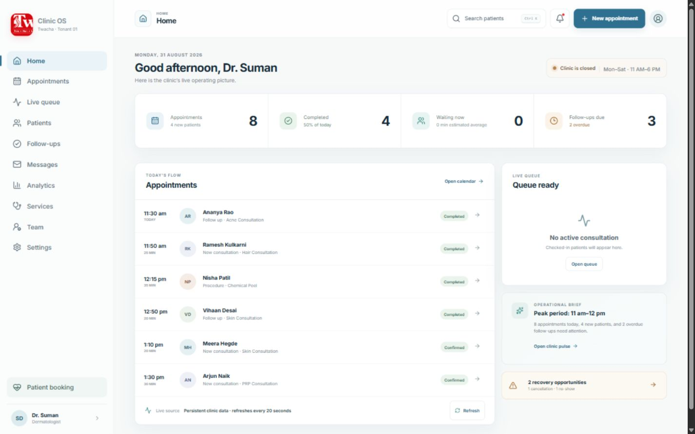
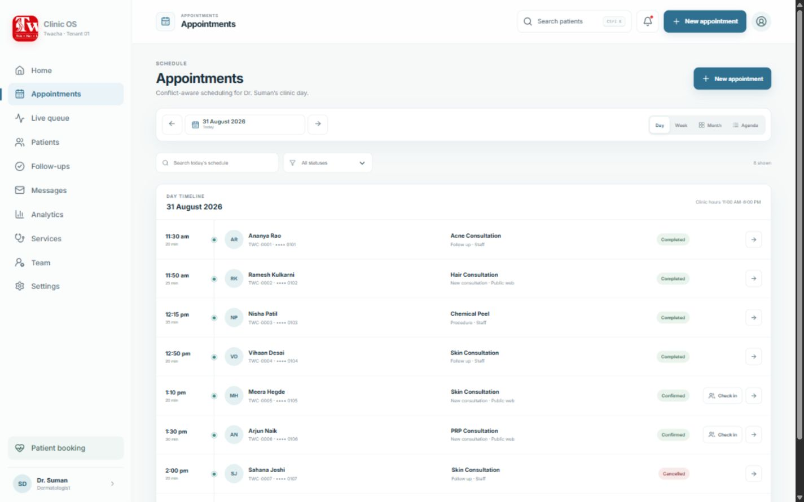
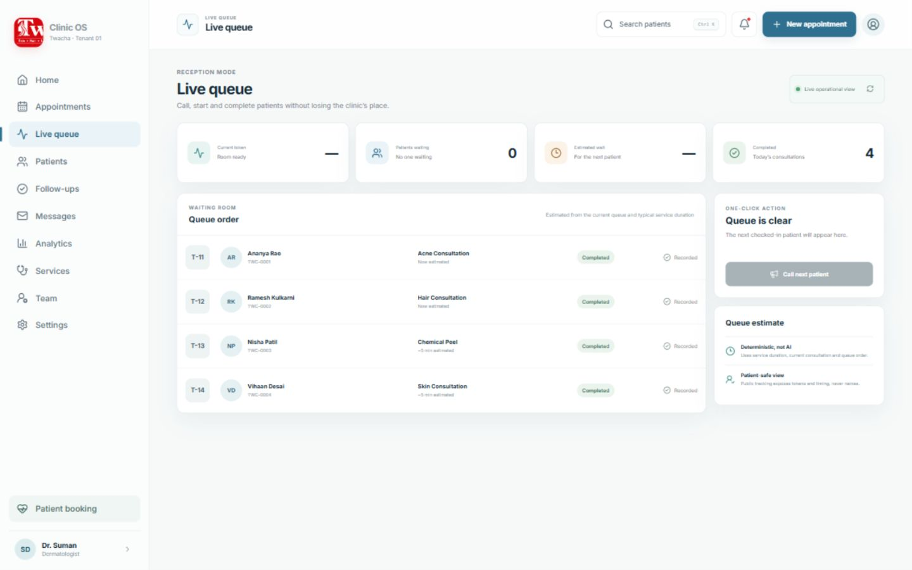
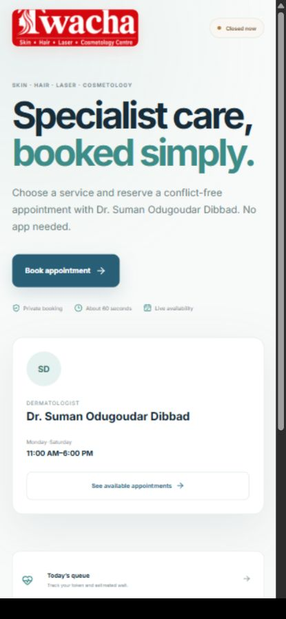
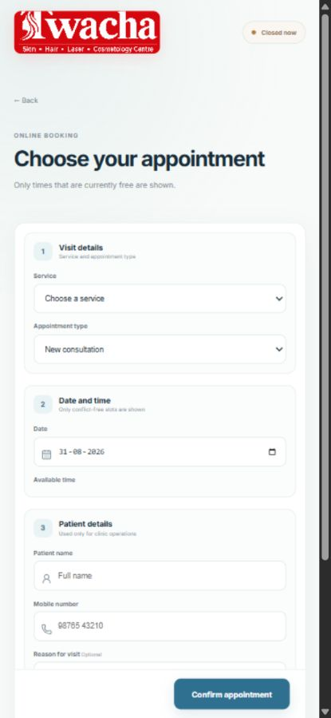
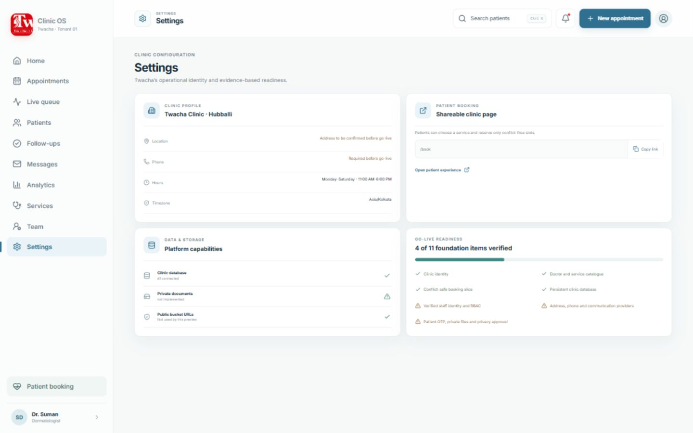

# Twacha Clinic OS — Product Audit

**Audit date:** 31 August 2026

**Audit basis:** rendered local product at 1440×900 and 430×932, repository and route inventory, database schema and migrations, APIs, auth/tenant context, tests, deployment configuration, product/security/design documentation, supplied Twacha logo, metadata assets, and historical screenshots.
**Release verdict:** **Not safe or complete for a real clinic launch tomorrow.** The current system is a polished owner-only vertical slice. It demonstrates a connected booking, appointment, queue, and follow-up loop, but it cannot yet support a real clinical encounter, checkout, or public healthcare workload.

This is a release-gate finding, not a visual-quality dismissal. The operating shell is coherent, fast, and unusually honest about unavailable integrations. The unsafe action would be to relabel the current preview as production.

## Evidence from the running product

### Command center

The overview creates a calm operating picture with actionable appointments, queue state, follow-ups, and an operational brief. It is a strong product foundation.

### Appointment operations

Day scheduling and one-tap check-in are usable. Patient detail actions, rescheduling, cancellation, blocks, holidays, walk-ins, and true week/month data are not complete.

### Queue operations

The queue is clear and deterministic. It is polling-based, has lifecycle race risks, and the patient tracker does not yet calculate all promised queue facts.

### Mobile patient booking

The patient entry experience is attractive, concise, and mobile-first. It still lacks OTP, returning-patient authority, doctor/family selection, verified contact details, secure link recovery, and communications delivery.

### Mobile booking form

The form has a good linear hierarchy, explicit consent, conflict-free availability, and usable touch controls. Booking remains an unverified public action.

### Go-live readiness

The product itself reports only 4 of 11 foundation items verified. That assessment is consistent with this audit.

## What is genuinely working

- The current Vinext production build, TypeScript check, lint, and four core tests pass.
- The UI has a coherent calm-healthcare direction, restrained Twacha red, clear hierarchy, useful empty/error/loading states, and responsive patient booking.
- D1 persistence, tenant columns, prepared statements, Zod validation, UUID identifiers, idempotency keys, and atomic appointment creation exist.
- Provider slot claims protect the implemented booking path from overlapping reservations.
- Booking creation, idempotent replay, and conflicting-slot rejection have been exercised locally over HTTP.
- Staff can view appointments, check in a patient, operate the queue, complete a consultation lifecycle row, create a follow-up, and rebook it.
- Queue arithmetic is deterministic and correctly labeled as non-AI.
- Public tracking minimizes direct identifiers; external communications and file storage are honestly shown as unavailable.
- Security and deployment documentation accurately restrict the build to a private preview and make no certification claim.
- The supplied Twacha logo is present, the social card is polished, and the overall product tone is substantially stronger than a generic clinic ERP.

## Severity summary

### CRITICAL

1. **Staff identity and tenant resolution are placeholders.** `server/clinic-context.ts` trusts an upstream email header, maps production identities to a default doctor role, and returns fixed Twacha tenant/location/provider IDs. Persisted staff, roles, status, and scopes are not resolved. The staff layout has no verified server-side auth boundary.
2. **Public healthcare actions are not production-safe.** Booking has no OTP, rate limit, abuse control, or returning-patient authority. Tracking uses a raw appointment UUID as the credential. Patient contact details, reasons, clinical text, and message bodies are plaintext.
3. **Production migrations contain development patient fixtures.** `drizzle/0001_seed_twacha.sql` contains named sample patients, visit reasons, appointments, queue states, follow-ups, consent, and audit data. The migration journal does not describe the same set of migrations.
4. **The repository is not a reproducible Twacha release.** Most Twacha files are untracked while older Torvent code, docs, assets, a public GitHub Pages workflow, two lockfiles, and a separate `ai50/` project remain in the same workspace.
5. **The clinical encounter cannot be completed.** There is no usable doctor consultation workspace, signed/amended clinical note, prescription authoring/print/PDF, secure document workflow, invoice, payment, receipt, or inventory transaction.
6. **A public production deployment would expose an unsafe workload.** The current docs correctly require owner-only access. Credentials alone cannot cure the auth, privacy, tenancy, lifecycle, clinical, and assurance gaps.

### HIGH

1. **Lifecycle concurrency can commit contradictory state.** Cancellation, check-in, and queue actions do guarded updates whose zero-row result is ignored while later side effects still run.
2. **Database tenant integrity is incomplete.** Tenant columns exist, but tenant-owned relationships lack composite `(tenant_id, id)` foreign keys and many enum/state invariants are not database-enforced.
3. **Staff scheduling is misclassified and incomplete.** A missing source defaults to `PUBLIC_WEB`; staff uses the public availability path; staff-only services can appear but cannot be scheduled correctly.
4. **Queue estimates are stale and not fully provider-isolated.** Check-in writes a zero estimate, recomputation waits for another queue action, and current reads can combine future provider queues.
5. **Authorization surfaces are overbroad.** A basic appointment-read grant can expose team emails and templates; assignment/location scopes are modeled but not enforced; sensitive patient reads are not audited.
6. **Testing is too shallow for healthcare operations.** There are no executable auth, cross-tenant, lifecycle race, OTP, file, encryption, backup/restore, accessibility, or browser E2E suites.
7. **The supplied logo is cropped in product use.** The source lockup is placed into square/cover treatments, altering the approved mark. Approved full and compact exports are required.
8. **Text is too small for sustained clinical work.** The active CSS contains extensive 6–11px type and low-contrast muted text. Several operational labels do not meet a WCAG AA reading target.
9. **Mobile reflow hides operationally important facts.** Appointment status, queue state, patient contact, and last-visit facts are removed instead of reformatted.
10. **Modal behavior is incomplete.** Focus trapping, restoration, Escape behavior, and background inertness are inconsistent.
11. **External continuity is not implemented.** WhatsApp/SMS/email screens and schema exist, but no provider adapter, dispatcher, retries, webhooks, consent suppression, or delivery audit path is live.

### MEDIUM

- Clinic hours, working days, provider, location, timezone behavior, and Sundays are hardcoded instead of driven by tenant configuration, schedules, holidays, and provider availability.
- Follow-ups do not automatically transition to due/overdue, and `CUSTOM` currently behaves as seven days without a custom-date control.
- Public tracking displays placeholder text for patients ahead rather than a calculated count.
- Week/month appointment controls imply broader coverage without fetching the complete displayed period.
- Cancellation overwrites general notes with a cancellation reason.
- Unique database errors are broadly mislabeled as slot conflicts; idempotency replay does not verify the original request fingerprint.
- Security headers, origin/CSRF policy, rate limits, file controls, webhook verification, structured observability, retention jobs, and restore drills are absent.
- The visual token layer contains many literal colors, type sizes, radii, and shadows, so written tokens do not govern the rendered system.
- Robots blocks all routes while the sitemap advertises `/book`; production metadata falls back to localhost if the environment is incomplete.
- The favicon is unrelated to Twacha, and naming mixes Clinic OS, Twacha Clinic, Twacha · Tenant 01, and TWACHA CLINIC OS.
- The patient marketing layer is visually attractive but uses a larger, more decorative language than the staff product, making them feel like adjacent systems.

### POLISH

- Turn the doctor/avatar affordances into real account controls or make them visually non-interactive.
- Replace the render-blocking Google Fonts import with a locally managed or framework-managed font.
- Consolidate product/tenant/clinic naming and approved logo treatments.
- Normalize numeric typography, status badges, button hierarchy, touch targets, and compact/table density through shared tokens.
- Remove unreachable Torvent surfaces and stale screenshots after an explicit clean-room migration, not by ad hoc deletion in a dirty worktree.

## Tomorrow-morning patient journey

| Journey step | Status | Current reality / release gate |
|---|---|---|
| Entry and booking | Partial | Mobile service/date/time booking works for one fixed doctor/location. OTP, family/returning-patient recognition, WhatsApp entry, QR, holidays, verified directions/contact, and best-slot logic are absent. |
| Confirmation | Partial | Confirmation UI and status URL work. No real delivery or secure link recovery exists. |
| Arrival | Partial | Staff check-in works. Walk-in and patient “I’m here” do not. |
| Queue | Partial | Staff lifecycle and polling work. Patients-ahead/current-token/delay/recommended-arrival calculations are incomplete. |
| Intake | Absent | No structured pre-visit intake, uploads, allergies/medications capture, or reviewable AI summary. |
| Consultation | Partial | Lifecycle rows exist. There is no doctor workspace, history brief, reviewed note draft, signing, or amendment workflow. |
| Prescription | Absent | No medication model, authoring, confirmation, print/PDF, share, or portal access. |
| Billing | Absent | No charges, invoice, tax, discount, partial payment, refund, receipt, or reconciliation. |
| Inventory | Absent | No product, batch, stock movement, expiry, supplier, or encounter-consumption workflow. |
| Continued care | Partial | Follow-up worklist and rebooking exist. Journeys, automation, messaging, progress timeline, images, and reminder suppression do not. |

## Requested module inventory

| Surface | Status | Principal gap |
|---|---|---|
| Command Center | Partial | Strong today view; missing role/context variants, lateness, payments, stock, recent activity, and a grounded morning brief. |
| Appointments | Partial | Day list/create/check-in work; no reschedule, repeat, walk-in, block, holiday, doctor choice, safe cancel UI, or true multi-day calendar. |
| Patient booking/tracking | Partial | Good mobile foundation; no OTP/capability, family/doctor choice, secure returning identity, QR, link recovery, or full queue facts. |
| Queue | Partial | Deterministic lifecycle works; polling only, concurrency risks, stale estimates, incomplete patient view. |
| Patients/families | Partial | Tenant search and compact preview work; create, full profile, timeline, relationships, files, consents, and communications are unavailable. |
| Consultation | Partial | Database lifecycle only; no usable doctor encounter screen or signed record. |
| Prescription | Absent | Entire medication and printable prescription workflow is missing. |
| Billing/payments | Absent | Entire checkout, invoice, payment, refund, and reconciliation workflow is missing. |
| Inventory/products | Absent | Entire product/batch/stock movement workflow is missing. |
| Follow-ups/recovery/waitlist | Partial | Basic worklist/rebook exists; no automation, slot recovery, offers, ownership, reminder engine, or waitlist UI. |
| Messages/WhatsApp | Partial | Templates/status only; no send pipeline or official-provider integration. |
| Files/progress images | Absent | R2 binding only; no authorized upload/download, scanning, metadata, or consented comparison workflow. |
| Analytics/Clinic Pulse | Partial | Today metrics work; no validated longitudinal datasets, trends, revenue, inventory, or fact/estimate/recommendation model. |
| AI layer | Absent/Partial | One static operational brief exists; no AI gateway, grounded tools, reviewed drafts, action center, intake, scribe, prescription structure, or audited workflow agent. |
| Services/team/settings | Partial | Read-only catalogue and readiness views; no safe editing, invitations, dynamic roles, schedules, branding, providers, or activation. |
| Onboarding/SaaS tenancy | Absent | No clinic provisioning, go-live wizard, trial states, subscription enforcement, multi-tenant admin, or demo-to-live switch. |
| Landing page | Absent for the SaaS product | `/book` is a clinic booking page, not the requested product marketing and trial-conversion surface. |

## Foundation audit

| Foundation | Status | Release gate |
|---|---|---|
| Verified staff auth/RBAC | Critical | Signed identity, active membership, persisted grants, location/assignment scope, session expiry, MFA/recovery. |
| Patient identity/capabilities | Critical | OTP/family authority, signed hashed expiring/revocable status links, rate limits. |
| Tenant isolation | Critical | Runtime tenant resolution, composite tenant FKs, negative cross-tenant tests, no Twacha business-logic constants. |
| Privacy/clinical safety | Critical | Encryption/key management, minimal reads, access audit, retention/export/erasure, legal approvals, safe AI review boundaries. |
| Production data/migrations | Critical | Schema-only migrations, separate demo seed, one ledger, clean install/upgrade checks, clear-demo workflow. |
| Deployment/release | Critical | Clean reproducible commit, private CI, environment validation, backup/restore, monitoring, launch approval. |
| Accessibility/performance | High | AA contrast/type scale, complete mobile facts, dialogs, keyboard/screen-reader, mobile-network and query/load tests. |
| Integrations | High | Real adapters, health checks, verified webhooks, retries, idempotency, consent, explicit NOT CONNECTED states. |

## Execution plan — dependency ordered

The plan is intentionally gated. Later phases must not be presented as production-ready while an earlier safety gate is open.

### Phase 0 — freeze, isolate, and make the release reproducible

1. Preserve the current branch and user changes.
2. Separate Twacha source from Torvent/AI50 artifacts without destructive cleanup.
3. Remove development patient fixtures from the production migration path and establish one migration ledger.
4. Replace the stale public Pages workflow with an explicit private release path.
5. Add CI gates for type, lint, build, unit, migration smoke, and integration tests.

**Exit:** a fresh checkout produces the same private application and empty production schema.

### Phase 1 — launch safety and identity

1. Add a branded fail-closed staff auth boundary and resolve staff membership from persistent data.
2. Enforce persisted role, tenant, location, assignment, and owner/admin scopes in every query.
3. Add patient OTP and signed, scoped, expiring status capabilities.
4. Add rate limits, strict origin/CSRF handling, security headers, minimized caching/referrer policy, and access audit.
5. Define encryption/key-management and blind-index migration for patient identifiers and clinical data.

**Exit:** unknown identities cannot reach staff data; patient links are revocable capabilities; cross-tenant and abuse tests pass.

### Phase 2 — repair the existing operational loop

1. Make booking source server-derived and split public/staff service and availability paths.
2. Make cancellation, check-in, and queue transitions abort atomically on version/state conflicts.
3. Recompute provider-isolated queue estimates on every relevant transition and calculate patients ahead.
4. Add reschedule, cancellation/no-show, walk-in, block, holiday, schedule, and complete calendar data.
5. Complete patient creation, detail, timeline, family, consent, and audited access.
6. Correct logo treatments, minimum type scale, contrast, mobile fact retention, dialogs, metadata, and favicon.

**Exit:** booking → arrival → queue is race-tested, role-tested, mobile-usable, and truthful.

### Phase 3 — connected clinical encounter and checkout

1. Build doctor pre-consultation brief and consultation workspace with draft/review/sign/amend states.
2. Build prescription entities, favorites/templates, explicit doctor confirmation, print/PDF, and secure share.
3. Build encounter-linked services/products, invoice, tax/discount, partial/multi-method payment, refund record, and receipt.
4. Build products, batches, stock movements, supplier/expiry/low-stock views, and encounter consumption.
5. Build authorized private file and consented progress-image workflows.

**Exit:** one encounter connects note → prescription → products/services → invoice → payment → follow-up with an auditable state trail.

### Phase 4 — continuity and safe AI

1. Add official-provider communication adapters, outbox, retries, webhooks, templates, preferences, and suppression.
2. Build care journeys, reminder stop conditions, progress timeline, waitlist, and atomic slot recovery.
3. Add an AI gateway for schema-bound extraction, summaries, retrieval, permission-aware tools, and audit.
4. Ship reviewed administrative AI first: intake summary, doctor context card, morning/reception/EOD briefs, action center, command reads, and confirmed writes.
5. Keep clinical note and prescription assistance as accept/edit/discard drafts; never autonomous diagnosis or prescribing.

**Exit:** every AI output is grounded, labeled, reviewable, permission-bound, and measurable; credentials absent states remain NOT CONNECTED.

### Phase 5 — activation, SaaS operations, and release verification

1. Build onboarding, progress, Twacha setup, QR, provider health, staff invites, demo-data clearing, and go-live approval.
2. Add trial/subscription state and verified Razorpay webhook architecture without fake success.
3. Add monitoring, alerting, performance telemetry, backups, restore drills, and incident runbooks.
4. Run browser E2E and visual/accessibility QA at 1440, 1280, 1024, 768, 430, and 390.
5. Deploy owner-only HTTPS first; move to clinic/public access only after Twacha verifies identity, hours, services, privacy, communications, billing, and recovery procedures.

**Exit:** every item in the deployment-verification checklist is evidenced against the deployed URL.

## Immediate deployment decision

- **Permitted now:** owner-only/private HTTPS preview using synthetic data, with preview labeling and no real patient workload.
- **Not permitted now:** public clinic booking or staff use with real patient/clinical/payment data.
- **Credential-blocked only:** none of the major workflows. WhatsApp and Razorpay still require adapter, webhook, consent, retry, and reconciliation code in addition to credentials.
- **Required external decisions:** verified clinic identity/contact/hours/services, auth provider, official WhatsApp provider and approved templates, Razorpay account/webhook secrets, privacy/retention approval, backup/incident owner, and authorized test recipients.

## Audit conclusion

The right strategy is not a wholesale visual rebuild. Preserve the calm operating shell and mobile booking foundation, then close safety, correctness, and encounter-continuity gaps in dependency order. A private HTTPS release can be useful immediately for Twacha review. A real-clinic production claim must wait for verified identity, privacy, tenant isolation, clinical records, checkout, operational recovery, and deployment evidence.
